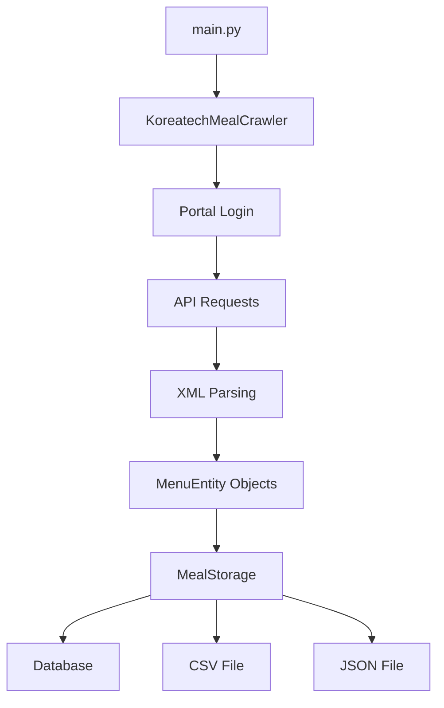

# K-Meal Scraping 🍽️

코리아텍(한국기술교육대학교) 식단 정보를 크롤링하여 데이터베이스에 저장하는 Python 프로젝트

## 📋 목차
- [프로젝트 구조](#프로젝트-구조)
- [아키텍처](#아키텍처)
- [설치 및 설정](#설치-및-설정)
- [사용법](#사용법)
- [스크래핑 과정](#스크래핑-과정)
- [데이터베이스 구조](#데이터베이스-구조)
- [출력 파일](#출력-파일)

## 🏗️ 프로젝트 구조

```
k-meal-scraping/
├── submodule                # 환경변수 (민감한 정보)
├── .env.example            # 환경변수 예시 파일
├── .gitignore              # Git 제외 파일
├── requirements.txt        # Python 의존성
├── main.py                 # 메인 실행 스크립트 (77줄)
├── README.md              # 프로젝트 문서
├── logs/                  # 로그 파일들
│   └── kmeal_scraping_*.log
├── src/                   # 소스 코드
│   └── kmeal/            # 메인 패키지
│       ├── __init__.py   # 패키지 초기화
│       ├── config.py     # 데이터베이스 설정
│       ├── models.py     # SQLAlchemy 모델
│       ├── crawler.py    # 크롤링 로직
│       ├── storage.py    # 데이터 저장
│       └── utils.py      # 유틸리티 함수
└── 출력 파일들
    ├── koreatech_meals_2025.csv
    └── koreatech_meals_2025.json
```

## 🏛️ 아키텍처

### 모듈별 역할

| 모듈 | 역할 | 주요 기능 |
|------|------|-----------|
| `main.py` | 실행 엔트리포인트 | 전체 프로세스 orchestration |
| `crawler.py` | 웹 크롤링 | 포털 로그인, API 요청, 데이터 파싱 |
| `storage.py` | 데이터 저장 | DB/CSV/JSON 저장 |
| `models.py` | 데이터 모델 | SQLAlchemy 모델 정의 |
| `config.py` | 설정 관리 | 데이터베이스 설정 |
| `utils.py` | 유틸리티 | 로깅 설정 등 |

### 데이터 플로우



## ⚙️ 설치 및 설정

### 1. 프로젝트 클론
```bash
git clone <repository-url>
cd k-meal-scraping
```

### 2. 가상환경 생성 및 활성화
```bash
# Python 가상환경 생성
python -m venv .venv

# 가상환경 활성화
# macOS/Linux:
source .venv/bin/activate
# Windows:
.venv\Scripts\activate
```

### 3. 의존성 설치
```bash
pip install -r requirements.txt
```

### 4. 환경변수 설정
```bash
# .env.example을 .env로 복사
cp .env.example .env

# .env 파일 편집
nano .env
```

`.env` 파일 설정 예시:
```env
# 코리아텍 포털 로그인 정보
PORTAL_ID=your_portal_id
PORTAL_PW=your_password
YOUR_IP_ADDRESS=your_ip_address

# 데이터베이스 설정
DB_HOST=your_db_host
DB_PORT=5432
DB_NAME=your_db_name
DB_USERNAME=your_db_username
DB_PASSWORD=your_db_password
DB_SSLMODE=disable
```

## 🚀 사용법

### 기본 실행
```bash
# 가상환경이 활성화된 상태에서
python src/main.py

# 또는 도움말 보기
python src/main.py --help
```

### 실행 모드

#### 1. 일반 모드 (기본값)
```bash
python src/main.py
```
- **날짜 범위**: 오늘 기준 **2주 전 ~ 2주 후** (총 29일)
- **용도**: 일상적인 식단 정보 업데이트
- **예시**: 2025-09-24 실행 시 → 2025-09-10 ~ 2025-10-08

#### 2. 초기 데이터 수집 모드
```bash
python src/main.py --init
```
- **날짜 범위**: **올해 1월 1일 ~ 오늘로부터 1달 후**
- **용도**: 처음 실행 시 대량 데이터 수집
- **예시**: 2025-09-24 실행 시 → 2025-01-01 ~ 2025-10-24

### 실행 과정
1. **인증**: 코리아텍 포털 로그인
2. **날짜 설정**: 선택한 모드에 따른 자동 날짜 범위 계산
3. **사용자 확인**: 수집할 데이터 양 확인 후 진행 여부 선택
4. **데이터 수집**: 모든 캠퍼스, 식당, 식사 시간별 크롤링
5. **데이터 저장**: DB, CSV, JSON 형태로 저장

## 🕸️ 스크래핑 과정

### 1. 포털 인증 (4단계)
```python
# 1단계: 로그인 자격증명 확인
POST /ktp/login/checkLoginId.do

# 2단계: 2차 로그인 인증 (선택적)
POST /ktp/login/checkSecondLoginCert.do

# 3단계: SSO 어서션
POST /exsignon/sso/sso_assert.jsp

# 4단계: 최종 SSO 로그인
GET /ssoLogin_ext.jsp?&PGM_ID=CO::CO0998W&locale=ko
```

### 2. 식단 데이터 요청
- **API 엔드포인트**: `https://kut90.koreatech.ac.kr/nexacroController.do`
- **요청 형식**: XML (Nexacro Platform)
- **인증 방식**: JSESSIONID 쿠키

### 3. 크롤링 대상
| 캠퍼스 | 식당 | 식사 시간 |
|--------|------|-----------|
| Campus1 | Korean Food (한식), Onedish Food (일품), Special Food, Faculty (능수관) | breakfast, lunch, dinner |
| Campus2 | 코너1 | breakfast, lunch, dinner |

총 **24개 조합** (5개 식당 × 3개 식사시간 + 1개 식당 × 3개 식사시간)을 매일 요청

### 4. 데이터 파싱
- XML 응답을 BeautifulSoup으로 파싱
- 메뉴 아이템에서 칼로리/가격 정보 제거
- `MenuEntity` 객체로 구조화

### 주요 특징
- **정규화된 구조**: 메뉴 아이템을 별도 테이블로 분리
- **중복 방지**: 복합 기본키로 중복 데이터 방지
- **계층적 삭제**: CASCADE 옵션으로 데이터 정합성 보장

## 📄 출력 파일

### 1. CSV 파일 (`koreatech_meals_2025.csv`)
```csv
date,dining_time,place,price,kcal,menu_items
2025-01-01,breakfast,Korean Food (한식),5000,650,김치찌개; 계란말이; 김치
```

### 2. JSON 파일 (`koreatech_meals_2025.json`)
```json
[
  {
    "date": "2025-01-01",
    "dining_time": "breakfast",
    "place": "Korean Food (한식)",
    "price": 5000,
    "kcal": 650,
    "menu": ["김치찌개", "계란말이", "김치"]
  }
]
```

### 3. 로그 파일 (`logs/kmeal_scraping_YYYYMMDD_HHMMSS.log`)
- 상세한 크롤링 과정 기록
- 에러 및 예외 상황 로깅
- 진행 상황 추적 가능

## 🛠️ 개발자 정보

### 성능 최적화
- **서버 부하 방지**: 요청 간 0.1초, 일간 0.5초 지연
- **에러 처리**: Connection 에러 시 스킵, 개별 실패가 전체에 영향 없음
- **메모리 효율성**: 스트리밍 방식 데이터 처리

### 보안 고려사항
- 환경변수를 통한 민감정보 관리
- `.gitignore`를 통한 인증 정보 제외
- 세션 기반 인증으로 보안 강화

### 확장성
- 모듈화된 구조로 기능 추가 용이
- 새로운 저장 형식 추가 가능
- 다른 캠퍼스/식당 추가 가능

---

## 📞 지원

문제 발생 시 이슈를 등록해주세요.

**개발자**: Choi-JJunho
**버전**: 1.0.0
**라이선스**: MIT